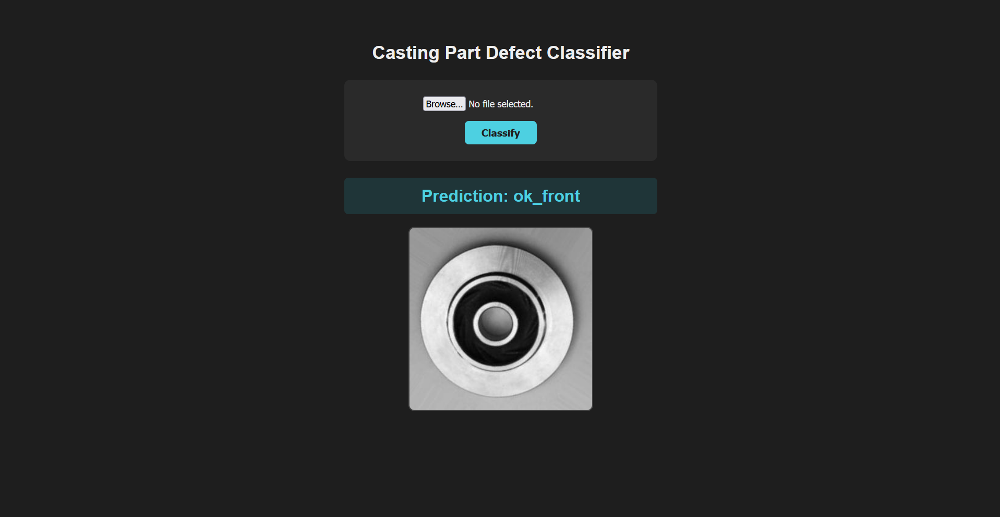
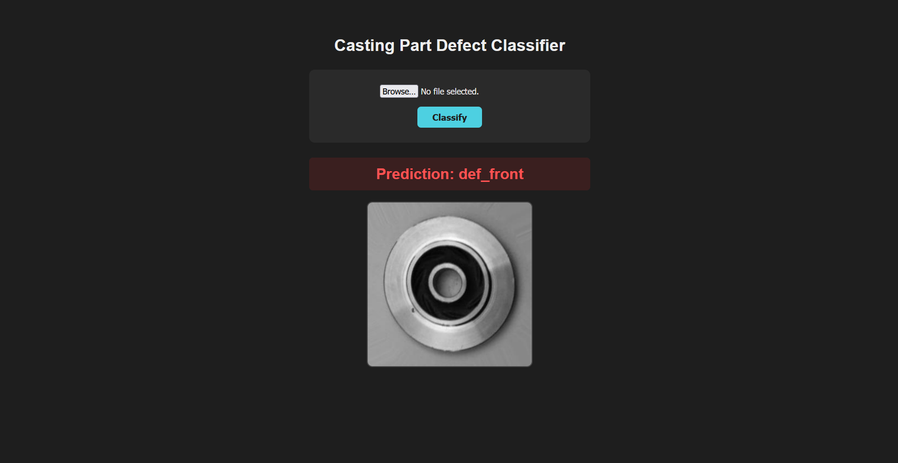

# Manufacturing Defect Classifier
 
A binary image classifier that flags defective vs. acceptable manufactured parts, built with transfer learning on a pretrained ResNet18, and served through a Flask web app for interactive predictions.
 



 
## Overview
 
This project fine-tunes a pretrained ResNet18 on real casting images to classify each part as **defective** (`def_front`) or **acceptable** (`ok_front`), then wraps the trained model in a simple web interface for live predictions on new images.
 
## Results
 
- **Test accuracy: 99.72%**
- Trained on ~20,000 labeled casting images, evaluated on a held-out test set of ~20,000 images
- Test loss and accuracy plateaued by epoch 3-4, indicating the model converged quickly on this dataset

| Epoch | Train Loss | Train Acc | Test Loss | Test Acc |
|---|---|---|---|---|
| 0 | 0.4404 | 0.8274 | 0.2204 | 0.9077 |
| 1 | 0.3014 | 0.8874 | 0.0779 | 0.9804 |
| 2 | 0.2171 | 0.9144 | 0.0185 | 0.9944 |
| 3 | 0.1026 | 0.9638 | 0.0192 | 0.9958 |
| 4 | 0.1053 | 0.9619 | 0.0111 | 0.9972 |
 
## Dataset
 
[Real-life Industrial Dataset of Casting Product](https://www.kaggle.com/datasets/ravirajsinh45/real-life-industrial-dataset-of-casting-product) — submersible pump impeller images, labeled as defective or acceptable, pre-split into train/test sets. Not included in this repo (see Setup below to download it yourself).
 
## Approach
 
Rather than training a CNN from scratch, this project uses **transfer learning**: starting from a ResNet18 pretrained on ImageNet, then replacing its final classification layer and fine-tuning the entire network on the casting dataset. Since pretrained models already encode general visual features (edges, textures, shapes) that transfer well to new domains, this means far less data and training time is needed than training from scratch.
 
**Pipeline:**
1. Load and preprocess casting images (resize, normalize to ImageNet statistics)
2. Replace ResNet18's 1000-class output layer with a 2-class layer (defective / ok)
3. Fine-tune all layers using SGD with a step-decay learning rate schedule
4. Track train/test loss and accuracy per epoch; save the best-performing checkpoint
5. Serve the trained model through a Flask API with a browser-based upload interface
## Tech Stack
 
- **ML:** PyTorch, torchvision (ResNet18, transfer learning)
- **Backend:** Flask
- **Frontend:** HTML/CSS (server-rendered via Jinja2 templates)
## Project Structure
 
```
├── main.py                  # Training orchestration: builds model, trains, saves weights
├── model.py                 # ResNet18 architecture definition
├── train.py                 # Training loop (train/test phases, checkpointing)
├── data.py                  # Dataset loading and transforms
├── config.py                # Device configuration (CPU/GPU)
├── visualize.py             # Visualizes sample predictions after training
├── app.py                   # Flask app for interactive inference
├── templates/
│   └── index.html           # Upload form + prediction display
├── model_weights.pth        # Trained model weights
└── requirements.txt
```
 
## Setup
 
**1. Clone and install dependencies:**
```bash
git clone https://github.com/Hosam-Issa/Manufacturing-Defect-Classifier
cd Manufacturing-Defect-Classifier
python -m venv venv
venv\Scripts\activate          # Windows
pip install -r requirements.txt
```
 
> **Note on PyTorch/CUDA:** if you have an NVIDIA GPU and want GPU-accelerated training, install PyTorch separately first using the correct command for your CUDA version from [pytorch.org/get-started/locally](https://pytorch.org/get-started/locally/), before running the command above. The CPU-only build works fine for running inference (the Flask app) even without a GPU.
 
**2. Download the dataset** (only needed to retrain the model since `model_weights.pth` is already included):
- Download from the [Kaggle link above](https://www.kaggle.com/datasets/ravirajsinh45/real-life-industrial-dataset-of-casting-product)
- Extract into an `archive/` folder in the project root, matching the path structure expected in `data.py`
**3. Run the web app:**
```bash
python app.py
```
Visit `http://127.0.0.1:5000`, upload a casting part image, and get an instant defect prediction.
 
**4. (Optional) Retrain the model:**
```bash
python main.py
```
 
## Future Improvements
 
- Multi-class classification for different defect types, rather than binary defective/ok
- Add prediction confidence scores alongside the classification
- Expand to a general-purpose defect detection tool across other manufacturing datasets